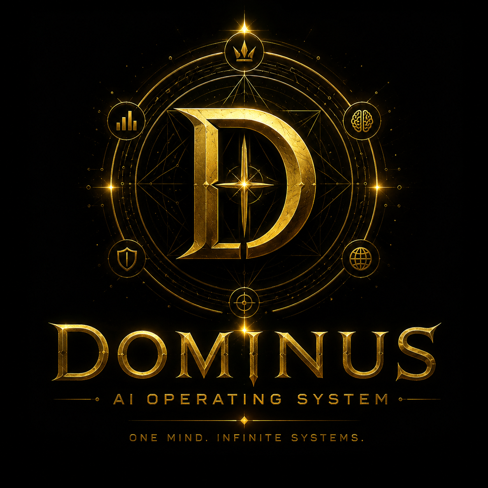

<div align="center">



# DOMINUS

### The Central Intelligence Operating System

**One Mind. Infinite Systems.**

<p align="center">
    
    
    
    
</p>

*A Personal AI Operating System built to orchestrate intelligent agents, financial intelligence, automation, knowledge, analytics, and decision-making through one centralized executive intelligence.*

</div>

---

# Vision

DOMINUS is **not another AI chatbot**.

DOMINUS is a **Personal AI Operating System (AI OS)** designed to orchestrate an ecosystem of intelligent services through one executive intelligence layer.

Instead of replacing existing applications, DOMINUS connects, monitors, analyzes, reasons, and coordinates every subsystem from one centralized platform.

Its long-term mission is simple:

> **One Intelligence. Unlimited Systems.**

---

# Philosophy

Traditional AI

```text
Human
   │
   ▼
AI Assistant
```

DOMINUS

```text
Human
   │
   ▼
DOMINUS Executive Intelligence
   │
   ├── Finance Intelligence
   ├── Prediction Intelligence
   ├── News Intelligence
   ├── Knowledge Intelligence
   ├── Automation Hub
   ├── Memory Engine
   ├── Analytics Center
   ├── Monitoring Center
   └── Plugin Ecosystem
```

DOMINUS acts as the executive intelligence responsible for coordinating specialized systems rather than replacing them.

---

# Architecture

```text
                                              DOMINUS
                                   Central Executive Intelligence
┌────────────────────────────────────────────────────────────────────────────────────────────┐
│                                                                                            │
│                                  Executive AI (Reasoning Layer)                           │
│                      Planning • Memory • Routing • Context • Decision Support             │
│                                                                                            │
└────────────────────────────────────────────────────────────────────────────────────────────┘
                                              │
                                              ▼
┌────────────────────────────────────────────────────────────────────────────────────────────┐
│                                 API Gateway / Command Router                              │
└────────────────────────────────────────────────────────────────────────────────────────────┘
                                              │
════════════════════════════════════════════ Event Bus ════════════════════════════════════════

        │                 │                 │                 │                 │
        ▼                 ▼                 ▼                 ▼                 ▼

┌─────────────┐   ┌─────────────┐   ┌─────────────┐   ┌─────────────┐   ┌─────────────┐
│ Finance MS  │   │Predictor MS │   │  News MS    │   │ Memory MS   │   │ Tools MS    │
└──────┬──────┘   └──────┬──────┘   └──────┬──────┘   └──────┬──────┘   └──────┬──────┘
       │                 │                 │                 │                 │
       ▼                 ▼                 ▼                 ▼                 ▼

 PostgreSQL         AI Models         Crawlers         Vector DB        External APIs

       ▲                 ▲                 ▲                 ▲                 ▲
       │                 │                 │                 │                 │

┌─────────────┐   ┌─────────────┐   ┌─────────────┐   ┌─────────────┐   ┌─────────────┐
│ Analytics   │   │Monitoring   │   │ Scheduler   │   │Notification │   │ Plugin SDK  │
└─────────────┘   └─────────────┘   └─────────────┘   └─────────────┘   └─────────────┘

═══════════════════════════════════════════════════════════════════════════════════════════════

                 Dashboard • Desktop • Mobile • REST API • CLI • WebSocket
```

---

# Core Principles

- Executive Intelligence
- Microservice Architecture
- Event-Driven Communication
- Human-in-the-loop
- AI Orchestration
- Plugin-first Design
- Long-term Memory
- Observability
- Security by Default
- Scalable Infrastructure

---

# Current Modules

- Executive AI
- Finance Intelligence
- Prediction Engine
- News Intelligence
- Knowledge Management
- Memory Engine
- Automation Hub
- Dashboard
- Analytics Center
- Monitoring Center

---

# Planned Modules

- Voice Intelligence
- Vision Intelligence
- AI Research Assistant
- Browser Agent
- Mobile Companion
- Local LLM Manager
- Knowledge Graph
- Workflow Builder
- Plugin Marketplace
- Multi-Agent Collaboration
- Distributed Deployment

---

# Technology Stack

### Backend

- Python
- FastAPI
- SQLAlchemy
- PostgreSQL
- Redis

### Artificial Intelligence

- OpenAI
- Ollama
- Transformers
- Sentence Transformers
- LangGraph
- MCP

### Frontend

- React
- Next.js
- TailwindCSS
- shadcn/ui

### Infrastructure

- Docker
- Docker Compose
- Kubernetes
- Nginx
- Prometheus
- Grafana

---

# Repository Structure

```text
dominus/

├── assets/
│   ├── logo.png
│   ├── banner.png
│   └── architecture.png
│
├── apps/
│   ├── dashboard/
│   ├── desktop/
│   ├── mobile/
│   └── api-gateway/
│
├── services/
│   ├── finance/
│   ├── predictor/
│   ├── news/
│   ├── memory/
│   ├── automation/
│   ├── analytics/
│   ├── monitoring/
│   └── notification/
│
├── ai/
│   ├── executive/
│   ├── reasoning/
│   ├── planner/
│   ├── router/
│   ├── memory/
│   └── prompts/
│
├── plugins/
├── shared/
├── infrastructure/
├── docs/
└── README.md
```

---

# Long-term Vision

DOMINUS aims to become a true **Personal AI Operating System** capable of orchestrating every intelligent subsystem from one centralized executive intelligence.

Rather than replacing humans, DOMINUS is built to amplify decision-making, automate complex workflows, and provide complete situational awareness across an entire personal AI ecosystem.

> **One Mind. Infinite Systems.**

---

## License

MIT License © 2026 DOMINUS Project