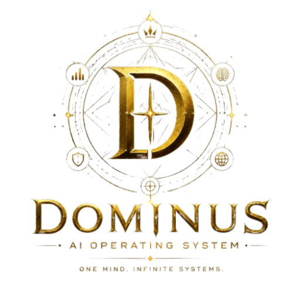

<div align="center">



# DOMINUS OS

### The Central Intelligence Operating System

**One Mind. Infinite Systems.**

<p align="center">
    
    
    
    
</p>

*Hệ điều hành trí tuệ nhân tạo cá nhân (AI OS) được xây dựng để điều phối, giám sát và vận hành các tác vụ tự động hóa, phân tích tài chính sinh trắc học và ra quyết định thông qua một lớp trí tuệ trung tâm duy nhất.*

</div>

---

# Tầm nhìn & Triết lý

DOMINUS không đơn thuần là một chatbot AI. Nó là một **Hệ điều hành Trí tuệ nhân tạo (AI OS)** được thiết kế để kết nối và điều phối các dịch vụ chuyên biệt qua một lớp Gateway và Executive AI Layer trung tâm.

Thay vì thay thế các phần mềm hiện tại, DOMINUS đóng vai trò là bộ não điều hành: giám sát hiệu năng, phân tích dữ liệu, tự động hóa luồng nghiệp vụ phức tạp, và cung cấp khả năng tương tác trực quan (Web Dashboard) kết hợp sinh trắc học bảo mật.

---

# Kiến trúc Hệ thống

Hệ thống hoạt động theo mô hình vi dịch vụ (Microservices) thời gian thực:

```text
                               +-----------------------------+
                               |     DOMINUS OS DASHBOARD    |
                               | (React, Next.js, WebSockets)|
                               +--------------+--------------+
                                              |
                                              | (HTTP / WS / Face Auth)
                                              v
                               +-----------------------------+
                               |    DOMINUS-BACKEND (Core)   |
                               |   (FastAPI Gateway Node)    |
                               +-------+--------------+------+
                                       |              |
                    (Shared DB Sync)   |              | (HTTP / WebSockets)
            +--------------------------+              |
            v                                         v
+-----------------------+                   +-----------------------+
|  POSTGRESQL DATABASE  |                   |   MARKOV-BRAIN (AI)   |
|   (Shared Storage)    |                   | (Probability Engine)  |
+-----------------------+                   +-----------------------+
```

### Chi tiết các Module & Công nghệ sử dụng:

1. **dominus-frontend (Next.js 16 + React 19 + TailwindCSS)**:
   - **Công nghệ**: Next.js 16 (App Router), React 19, TailwindCSS v4, Lucide Icons, Recharts (vẽ biểu đồ win rate).
   - **Tính năng**: Giao diện điều khiển kính mờ (glassmorphism) hoàng gia, WebSocket giao tiếp thời gian thực, và tích hợp bộ thư viện **Face-API.js** (TensorFlow.js) chạy cục bộ trên trình duyệt để phát hiện mốc sinh trắc học khuôn mặt.

2. **dominus-backend (FastAPI + SQLAlchemy + PostgreSQL)**:
   - **Công nghệ**: FastAPI (Python), SQLAlchemy ORM, Pydantic v2 (xác thực dữ liệu), Uvicorn server, hashlib (băm mật khẩu SHA-256 có muối).
   - **Tính năng**: API Gateway điều hướng trung tâm, phân quyền người dùng, so khớp vector khuôn mặt (thuật toán tính khoảng cách Euclidean ở database), ghi nhận log/metrics và chạy các tác vụ health check song song bằng `asyncio.gather`.

3. **MarkovBrain (Python + Pandas + NumPy)**:
   - **Công nghệ**: Python Core, Pandas & NumPy (phân tích chuỗi số liệu lớn), SQLAlchemy, Redis Client.
   - **Tính năng**: Phân tích ma trận chuyển trạng thái Markov và Heuristics chuỗi bệt (Streaks). Nạp tự động dữ liệu lịch sử từ PostgreSQL lên RAM khi khởi chạy để phục vụ thuật toán phân tích xác suất.

---

# Sơ đồ Thư mục Dự án

```text
dominus-os/
├── assets/                 # Tài nguyên hình ảnh, Logo SVG không nền
├── MarkovBrain/            # [Service] Lớp phân tích xác suất xổ số real-time
│   ├── src/
│   │   ├── core/           # Thuật toán Markov & phân tích Heuristics
│   │   └── database/       # Quản lý DataStore và kết nối PostgreSQL
│   └── main.py             # File khởi chạy MarkovBrain
├── dominus-backend/        # [Core BE] Gateway, API Auth & Sinh trắc học
│   ├── src/
│   │   ├── database/       # Models người dùng (password_hash, face_embedding)
│   │   └── gateway/        # API Routes điều hướng & Healthcheck
│   └── main.py             # File khởi chạy dominus-backend
├── dominus-frontend/       # [Core FE] Giao diện điều hành Dashboard & Auth
│   ├── src/
│   │   ├── app/            # Cấu hình Next.js App Router
│   │   └── modules/        # UI Components (AuthScreen, Sidebar, Analytics)
│   └── package.json
├── run.bat                 # Script tự động khởi chạy toàn bộ hệ thống
└── README.md
```

---

# Hướng dẫn Khởi chạy Nhanh

### 1. Chuẩn bị Cơ sở dữ liệu
Hệ thống sử dụng chung cơ sở dữ liệu **PostgreSQL** để chia sẻ trạng thái đồng bộ giữa các dịch vụ. Cần chuẩn bị một cơ sở dữ liệu PostgreSQL và khai báo thông tin kết nối thông qua biến môi trường.

### 2. Cấu hình Môi trường
Tạo file `.env` ở các thư mục tương ứng theo hướng dẫn cấu hình mẫu:
- **dominus-backend**: Cấu hình chuỗi kết nối PostgreSQL thông qua biến `DATABASE_URL` trong file `.env`.
- **MarkovBrain**: Tự động kết nối và đồng bộ các bảng lịch sử trong DB PostgreSQL.

### 3. Chạy toàn bộ hệ thống bằng một click
Tại thư mục gốc của dự án `dominus-os`, chạy file batch tự động điều phối:
```bash
./run.bat
```
Script sẽ tự động:
1. Kích hoạt môi trường ảo Python (`.venv`) và khởi động **dominus-backend** ở cổng `8001`.
2. Khởi động **MarkovBrain** ở cổng `8000`.
3. Khởi chạy **dominus-frontend** ở cổng `3000` (Next.js Dev Server).

Truy cập Dashboard tại: [http://localhost:3000](http://localhost:3000)

---

# Integration Services

Hệ thống DOMINUS tích hợp và quản lý các service chuyên biệt thông qua API và giao thức thời gian thực:

1. **MarkovBrain**: Dịch vụ phân tích và dự đoán xổ số thời gian thực. DOMINUS đóng vai trò cấu hình tham số, kích hoạt chiến thuật quản lý vốn, và giám sát hiệu năng/win rate.
2. **Mark-XLIX**: Trợ lý AI Jarvis chạy cục bộ hỗ trợ bởi Google Gemini Live API. Cung cấp giao tiếp giọng nói thời gian thực và tương tác hệ thống. DOMINUS tích hợp làm kênh điều khiển điều phối chính.

---

# Quy trình Xác thực Sinh trắc học (Face Auth)

1. **Đăng ký**: Người dùng nhập thông tin và mật khẩu tại màn hình Đăng ký. Hệ thống tự động ghi nhận và đồng thời chụp/lưu trữ vector khuôn mặt ban đầu.
2. **Quét khuôn mặt**:
   - Nhập Username của bạn.
   - Nhấn **Bấm để quét và đăng nhập**. Camera sẽ hiển thị radar quét sinh trắc.
   - TensorFlow.js (Face-API) sẽ trích xuất vector khuôn mặt thật gồm 128 số thực.
   - Gửi lên backend để so khớp. Nếu khoảng cách sai lệch Euclidean giữa vector mới và vector trong DB nhỏ hơn `0.6`, bạn sẽ được cấp quyền truy cập ngay lập tức.

---

## Giấy phép Giới hạn
Phát hành theo giấy phép [MIT License](./LICENSE) © 2026 DOMINUS Project.