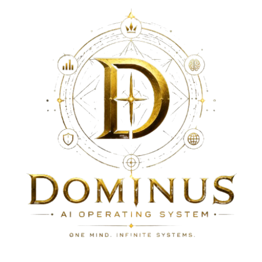

<div align="center">



# DOMINUS OS

### The Central Intelligence Operating System

**One Mind. Infinite Systems.**

<p align="center">
    
    
    
    
</p>

*Hệ điều hành trí tuệ nhân tạo cá nhân (AI OS) được xây dựng để điều phối, giám sát và vận hành các tác vụ tự động hóa, phân tích tài chính sinh trắc học và ra quyết định thông qua một lớp trí tuệ trung tâm duy nhất.*

</div>

---

# Tầm nhìn & Triết lý

DOMINUS không đơn thuần là một chatbot AI. Nó là một **Hệ điều hành Trí tuệ nhân tạo (AI OS)** được thiết kế để kết nối và điều phối các dịch vụ chuyên biệt qua một lớp Gateway và Executive AI Layer trung tâm.

Thay vì thay thế các phần mềm hiện tại, DOMINUS đóng vai trò là bộ não điều hành: giám sát hiệu năng, phân tích dữ liệu, tự động hóa luồng nghiệp vụ phức tạp, và cung cấp khả năng tương tác trực quan (Web Dashboard) kết hợp sinh trắc học bảo mật.

---

# Kiến trúc Hệ thống

Hệ thống hoạt động theo mô hình điều phối trung tâm kết hợp các vi dịch vụ thời gian thực:

```text
                      +---------------------------------------+
                      |         DOMINUS-ASSISTANT (HUD)       |
                      |   (PySide6 App / Gemini Live API)     |
                      +-------------------+-------------------+
                                          |
                                          | (Khởi chạy bằng ServiceOrchestrator)
                                          v
      +-------------------------+---------+---------+-------------------------+
      |                         |                   |                         |
      v                         v                   v                         v
+-----------+             +-----------+       +-----------+             +-----------+
| PostgreSQL|             |MarkovBrain|       |dominuscore|             |    ui     |
| (SharedDB)|<----------->| (Port8000)|<----->| (Port8001)|<----------->| (Port8084)|
+-----------+             +-----------+       +-----------+             +-----------+
                                                                     (NiceGUI Dashboard)
```

### Chi tiết các Module & Công nghệ sử dụng:

1. **dominus-assistant (Python + PySide6 + Gemini Live API)**:
   - **Công nghệ**: PySide6 (giao diện đồ họa), Google GenAI SDK (Gemini Live API sử dụng model `gemini-2.5-flash-native-audio-preview`), sounddevice (thu/phát âm thanh thời gian thực).
   - **Tính năng**: Giao diện HUD tương tác giọng nói thời gian thực với hiệu ứng Ambient Orb 3D co giãn theo nhịp thở sinh học. Tích hợp lớp **ServiceOrchestrator** tự động khởi chạy, kiểm soát vòng đời và ghi logs cho 3 tiến trình nền: `markov_brain`, `backend` (`dominus-core`), và `dashboard` (`ui`).

2. **dominus-core (FastAPI + SQLAlchemy + PostgreSQL)**:
   - **Công nghệ**: FastAPI (Python), SQLAlchemy ORM, Pydantic v2. Chạy trên cổng mặc định **`8001`**.
   - **Tính năng**: API Gateway điều hướng, quản lý cấu hình hệ thống, xác thực người dùng bảo mật, và hỗ trợ so khớp vector sinh trắc học khuôn mặt từ database PostgreSQL.

3. **MarkovBrain (Python + FastAPI + Pandas + NumPy)**:
   - **Công nghệ**: FastAPI, Pandas & NumPy (phân tích số liệu lớn), SQLAlchemy, Redis. Chạy trên cổng mặc định **`8000`**.
   - **Tính năng**: Phân tích ma trận chuyển trạng thái Markov và Heuristics chuỗi bệt (Streaks) thời gian thực. Tự động cào dữ liệu qua kết nối WebSocket và đồng bộ hóa vào PostgreSQL.

4. **ui (Python + NiceGUI + TailwindCSS/HTML5)**:
   - **Công nghệ**: NiceGUI, TailwindCSS v4, Recharts (vẽ biểu đồ phân tích). Chạy trên cổng mặc định **`8084`**.
   - **Tính năng**: Giao diện Web Dashboard quản trị sẫm màu (glassmorphism hoàng gia), WebSocket cập nhật trạng thái thời gian thực, tích hợp các trang: Analytics (Phân tích), Mock Trading (Giao dịch giả lập), AI Assistant (Cấu hình trợ lý), và Service Logs (Xem logs các tiến trình).

---

# Sơ đồ Thư mục Dự án

```text
dominus-os/
├── assets/                 # Tài nguyên hình ảnh, Logo SVG không nền
├── logs/                   # Thư mục lưu log tự động của các tiến trình nền
├── MarkovBrain/            # [Service] Lớp phân tích xác suất xổ số real-time
│   ├── src/
│   │   ├── core/           # Thuật toán Markov & phân tích Heuristics
│   │   └── database/       # Quản lý DataStore và kết nối PostgreSQL
│   └── main.py             # File khởi chạy MarkovBrain (chạy trên Port 8000)
├── dominus-core/           # [Core BE] Gateway, API Auth & Quản lý DB
│   ├── src/
│   │   ├── database/       # Models người dùng & cấu hình hệ thống
│   │   └── gateway/        # API Routes điều hướng & Healthcheck
│   └── main.py             # File khởi chạy dominus-core (chạy trên Port 8001)
├── dominus-assistant/      # [Orchestrator HUD] Trợ lý AI và Lõi điều phối chính
│   ├── actions/            # Tập hợp các công cụ điều khiển hệ thống, duyệt web, file
│   ├── core/               # Prompt cấu hình AI
│   ├── memory/             # Quản lý bộ nhớ phiên và thông tin cá nhân
│   ├── main.py             # File chạy chính của trợ lý AI & kết nối Gemini Live
│   └── ui.py               # PyQt6/PySide6 HUD & ServiceOrchestrator
├── ui/                     # [Dashboard FE] NiceGUI Web Dashboard quản trị
│   ├── pages/              # Các trang giao diện (Analytics, Trading, Config, Services)
│   └── main.py             # File chạy NiceGUI Dashboard (chạy trên Port 8084)
├── run.bat                 # Script tự động khởi chạy toàn bộ hệ thống
└── README.md
```

---

# Hướng dẫn Khởi chạy Nhanh

### 1. Chuẩn bị Cơ sở dữ liệu
Hệ thống sử dụng cơ sở dữ liệu **PostgreSQL** và **Redis** để lưu trữ và chia sẻ trạng thái đồng bộ giữa các dịch vụ. Cấu hình thông tin kết nối thông qua file `.env`.

### 2. Cấu hình Môi trường
Tạo file `.env` tại thư mục `dominus-core/` và khai báo chuỗi kết nối PostgreSQL thông qua biến `DATABASE_URL` và thông tin Redis.

### 3. Chạy toàn bộ hệ thống bằng một Click
Tại thư mục gốc của dự án `dominus-os`, chạy file batch tự động điều phối:
```bash
./run.bat
```
Script sẽ tự động:
1. Kích hoạt môi trường ảo Python (`.venv`) của `MarkovBrain`.
2. Khởi chạy **dominus-assistant** HUD trên màn hình của bạn.
3. **ServiceOrchestrator** trong HUD sẽ tự động chạy song song 3 tiến trình nền:
   - **MarkovBrain** ở cổng `8000`.
   - **dominus-core** ở cổng `8001`.
   - **NiceGUI Web Dashboard** ở cổng `8084`.

Truy cập Dashboard quản trị tại: [http://localhost:8084](http://localhost:8084)

---

# Integration Services

Hệ thống DOMINUS tích hợp và quản lý các service chuyên biệt thông qua API và giao thức thời gian thực:

1. **MarkovBrain**: Dịch vụ phân tích và dự đoán xổ số thời gian thực. DOMINUS đóng vai trò cấu hình tham số, kích hoạt chiến thuật quản lý vốn, và giám sát hiệu năng/win rate.
2. **Mark-XLIX**: Trợ lý AI Jarvis chạy cục bộ hỗ trợ bởi Google Gemini Live API. Cung cấp giao tiếp giọng nói thời gian thực và tương tác hệ thống. DOMINUS tích hợp làm kênh điều khiển điều phối chính.

---

# Các Cải tiến & Tính năng mới phát triển

Gần đây, hệ thống DOMINUS OS đã được nâng cấp toàn diện về cả mặt trải nghiệm người dùng (UX/UI) và hiệu năng cốt lõi:

1. **Thiết kế lại Giao diện Trợ lý (Modern & Elegant Assistant UI)**:
   - **Ambient Orb**: Thay thế các vòng quay cơ khí sci-fi thô cứng bằng quả cầu năng lượng phát sáng 3D mượt mà ở tâm (sử dụng Radial Gradient đa lớp). Quả cầu tự động co giãn theo nhịp thở sinh học (Breathing effect) tương ứng với trạng thái hoạt động (`SLEEPING`, `LISTENING`, `THINKING`, `SPEAKING`).
   - **Giao diện phẳng kính mờ**: Bo tròn các góc panel (`6px` đến `8px`), làm mảnh viền và chuyển sang tông màu sẫm Slate nhã nhặn (`#0a0c10`) giúp giảm mỏi mắt.
   - **Typography Hiện đại**: Loại bỏ toàn bộ font chữ monospace cũ, thay thế bằng font chữ sans-serif hình học (**Segoe UI** / **Inter**) sắc nét, hiện đại.

2. **Khắc phục Lỗi Kỹ thuật & Tối ưu hóa Hiệu năng**:
   - **Giải quyết lỗi IPv6 Resolve trên Windows**: Chuyển đổi toàn bộ API endpoints từ `localhost` sang `127.0.0.1` để ngăn Windows tự động phân giải nhầm sang IPv6 `::1`, đảm bảo kết nối mạng luôn thông suốt.
   - **Thread-safety cho PyQt Camera**: Sử dụng cơ chế Qt Signals (`_start_cam_stream_sig`, `_stop_cam_stream_sig`) để điều khiển camera an toàn từ luồng phụ asyncio của `DominusUI` mà không gây crash ứng dụng.
   - **Tối ưu hóa Ghi DB song song**: Loại bỏ việc dọn dẹp tự động bất tuần tự tạo luồng ghi song song trong `records_mixin.py` của MarkovBrain. Chuyển sang dọn dẹp chủ động sau khi nạp lịch sử hoặc thêm mới bản ghi thành công trong WebSocket scraper, giải quyết nghẽn kết nối database.
   - **Sửa lỗi hiển thị số dư ví**: Khắc phục lỗi trích xuất dữ liệu lồng trong Dashboard NiceGUI giúp hiển thị chính xác số dư thực tế thay vì hiển thị mặc định `0 VND`.

---

# Quy trình Xác thực Sinh trắc học (Face Auth)

1. **Đăng ký**: Người dùng nhập thông tin và mật khẩu tại màn hình Đăng ký. Hệ thống tự động ghi nhận và đồng thời chụp/lưu trữ vector khuôn mặt ban đầu.
2. **Quét khuôn mặt**:
   - Nhập Username của bạn.
   - Nhấn **Bấm để quét và đăng nhập**. Camera sẽ hiển thị radar quét sinh trắc.
   - TensorFlow.js (Face-API) sẽ trích xuất vector khuôn mặt thật gồm 128 số thực.
   - Gửi lên backend để so khớp. Nếu khoảng cách sai lệch Euclidean giữa vector mới và vector trong DB nhỏ hơn `0.6`, bạn sẽ được cấp quyền truy cập ngay lập tức.

---

## Giấy phép Giới hạn
Phát hành theo giấy phép [MIT License](./LICENSE) © 2026 DOMINUS Project.